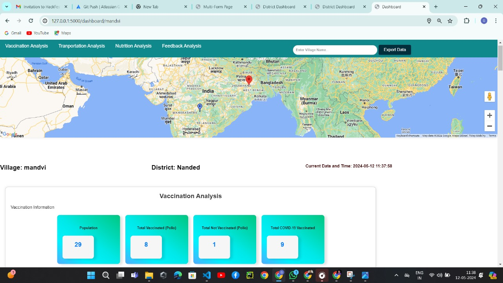
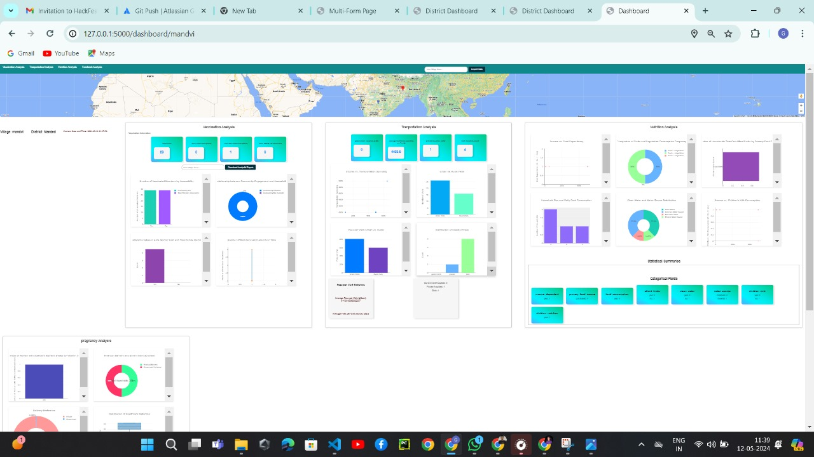
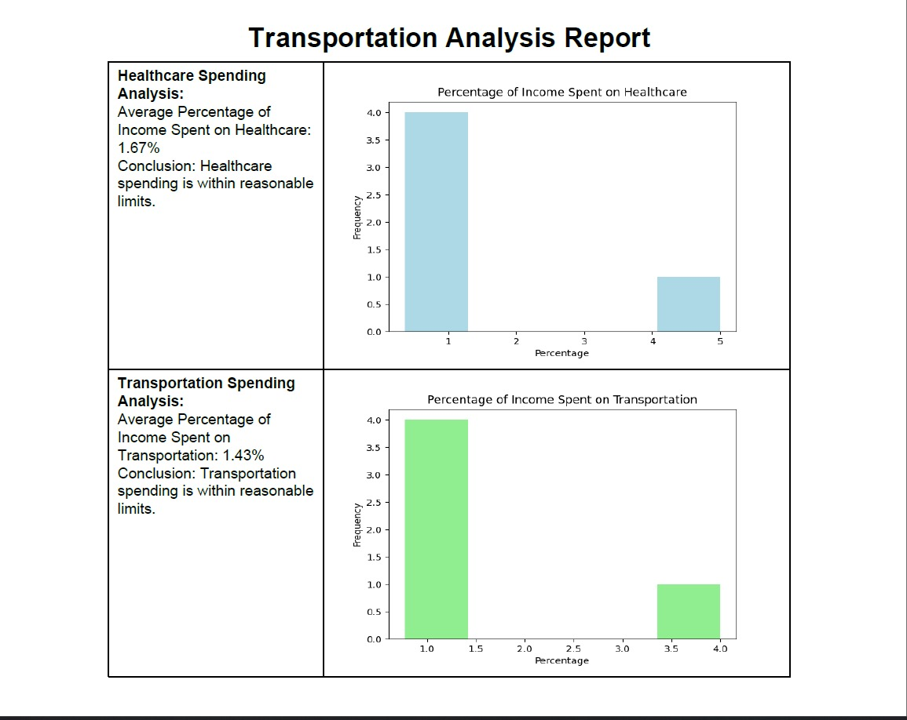
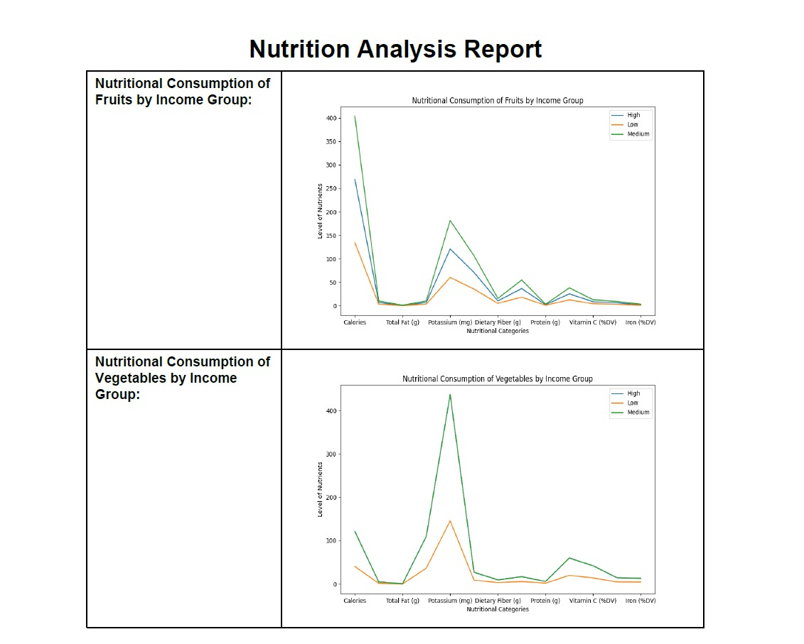

# `thewatchdogs`

###  Tech Stack-AWS,Generative Ai, Machine Learning, Flask Framework, Python, MongoDB, HTML, CSS, JS, Google Map API. DASH and Plotliy.

#### Problem Statement:Empowering Rural Health Governance in India: An AI-Driven Centralized Portal
* **Solution**:
1. Our initiative tackles the complex challenges of rural health in India through the creation of an innovative AI-powered centralized portal. 
2. This platform serves as a dynamic tool for assessing village health statuses and identifying the array of obstacles confronting rural areas, spanning healthcare, economic disparity, infrastructure deficiencies, and transportation accessibility.
3. Integral to our solution is the active participation of local health workers who input vital data onto the portal, which then harnesses advanced AI algorithms to analyze trends and uncover underlying issues. 
4. The portal generates detailed reports tailored for different tiers of governance, ensuring that gram panchayats, districts, and state authorities receive pertinent insights to inform targeted interventions. 
By centralizing data access, our system promotes transparency and accountability across government levels, facilitating swift action and enabling lower authorities to escalate critical issues to higher levels for resolution. Notably, our portal also empowers policy makers with actionable intelligence, guiding evidence-based policy reforms to address systemic challenges.
5. Through these concerted efforts, we envision a significant enhancement in rural healthcare outcomes and the overall well-being of India's rural populace.

* **WorkFlow**: Data Collection: Local health workers stationed in villages collect data pertaining to health conditions, economic status, infrastructure, and transportation accessibility using standardized forms.
Data Upload: Health workers input the collected data onto the AI-enabled centralized portal, providing a comprehensive snapshot of the village's health landscape.
Data Analysis: The portal utilizes sophisticated AI algorithms to analyze the uploaded data, identifying patterns, trends, and correlations across various parameters.
Root Cause Identification: Through advanced analytics, the portal identifies root causes behind prevalent health issues and other challenges faced by rural communities.
Report Generation: Based on the analysis, the portal generates comprehensive reports that outline the health and socio-economic status of the village, highlighting key findings and recommendations.
Access Control: The portal features a hierarchical access system, allowing different levels of government to access relevant data. Gram panchayats can view and act upon data specific to their village, while district authorities have access to aggregated data from all villages within their jurisdiction. State-level authorities can access data from across districts for comprehensive planning and decision-making.
Actionable Insights: Decision-makers at each level of governance utilize the insights gleaned from the portal to formulate targeted interventions and allocate resources effectively.

